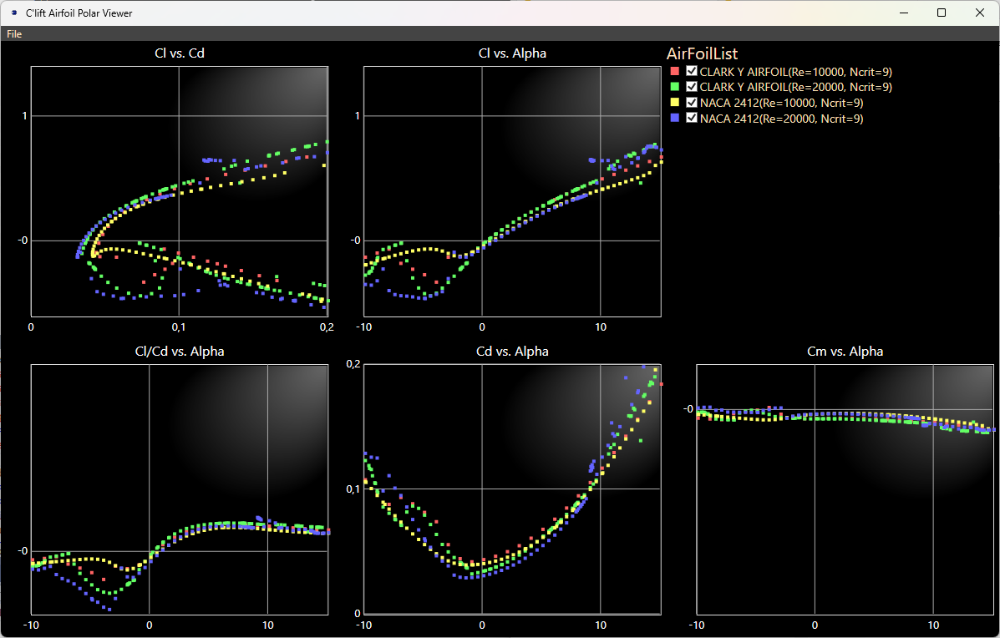

# C'lift - Airfoil Polar Viewer
<i>[siːˈlɪft]</i>

## Overview
This application allows viewing of Polar files generated by the <a href='https://de.wikipedia.org/wiki/XFOIL'>Xfoil</a> tool.

Screenshot:

 
 

## Usage
- Open Application
- Drag & Drop Polar files on the application window. Display of multiple files supported.
- Move with the mouse over any of the points on the chart. The actual values will be shown.  
 
 

## License
<a href='License.md'>MIT License</a>
 
 

## Runs on
Windows X86 and X64
 
 

## Install
<i>(The following video shows how to install such applications: <a href='https://youtu.be/4t2TI8ImwMY?t=2511'>https://youtu.be/4t2TI8ImwMY?t=2511</a>)</i>
- <b>Step #1: Select and download release:</b> 
    - Find the latest release here: <a href='https://github.com/TrueAquarius/Clift/releases'>https://github.com/TrueAquarius/Clift/releases</a>. 
    - Download the <i>.cer</i>-file (Code Signing Certificate) and the <i>.msixbundle</i>-file (Application) to your machine.
- <b>Step #2: Install Code Signing Certificate</b> (only required for the first install):
    - If you install this application for the first time, you need to install the Code Signing Certificate first. 
    - Right-click on the <i>.cer</i>-file. Select '<i>Install Certificate</i>'.
    - Recommended: Select '<i>Local Machine</i>' (if you wish, keep '<i>Current User</i>'; then the application will be available to you only). Click '<i>Next</i>'.
    - The '<i>Certificate Import Wizard</i>' pops up. Select '<i>Place all certificates in the following store</i>'. Click '<i>Browse</i>'. 
    - Select '<i>Trusted Root Certification Authorities</i>'. Click '<i>Ok</i>'.
    - Click '<i>Next</i>' (on the '<i>Certificate Import Wizard</i>').
    - You should get a message that the certificate was installed successfully.
- Step #3: Install Application.
    - Double-Click on the <i>.msixbundle</i>-file.
    - Click '<a>Install</a>'

